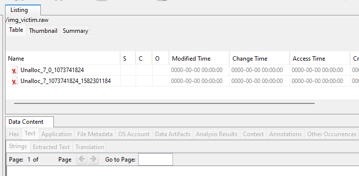
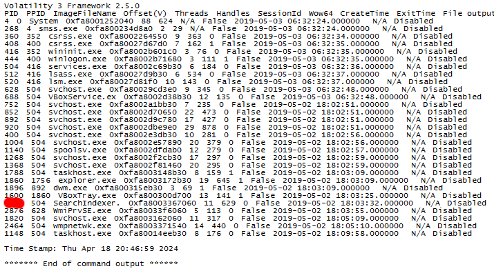
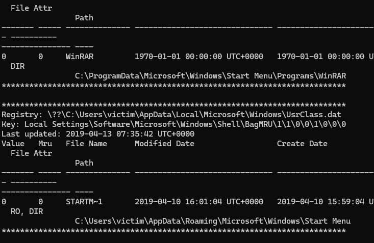
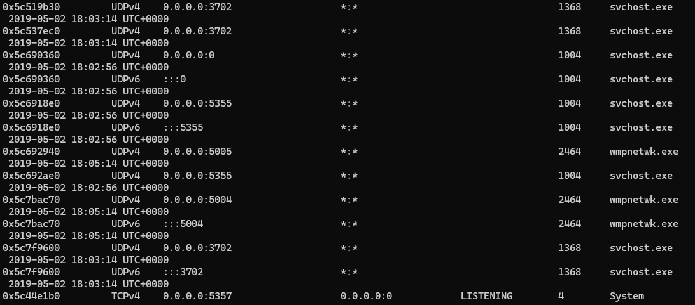
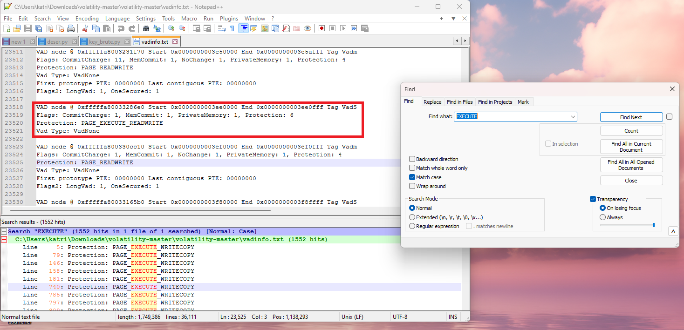
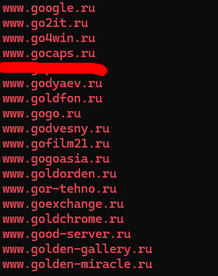

---

Today, I'm going to walk through how I solved [Try Hack Me's Forensics](https://tryhackme.com/r/room/forensics) practice challenge. The task is to analyze a memory dump of a target system and find the malicious files. It largely focuses on identifying different IOC.

## Task 1
### Getting Started
My first instinct is to open up autopsy and pull the image into that program to analyze. Completely incorrect method. Well, not completely. I was able to see the hex dump of the image, but it was listing as two unallocated partitions that showed as deleted. 

My next go-to is going to be using binwalk to extract the file system. I executed `binwalk -e victim.raw` to extract the data and other information. This seemed to be extracting something. 

The first question was:

> What is the Operating System of this Dump file? (OS name)

This was pretty straight forward as the extracted files all were referencing the OS. 

### Digging Deeper
Extracting all those files via binwalk was unrealistic. I went back to Autopsy to see what options I had. Nothing still. It seemed to get stuck processing the image. 

After researching other ways to analyze a memory dump, I ran into someone mentioning Volatility, which I vaguely remembered was good for analyzing system dumps. I also hadn't paid attention to the room having the Volatility logo on it which would've saved me some time.

I hadn't used it much up to this point, but I switched to a using Volatility. At first, I used Volatility Workbench.

This gave me the answer to the next question: 

> What is the PID of SearchIndexer.

In Volatility Workbench, there is an option to view processes once you specify the memory dump. So, I dumped the memory processes, which gave me all the processes on the target system.

### Files Upon Files...
In the meantime, my Autopsy scan was still running away. I decided to check up on that as it seemed some more files were uncovered as the image was being analyzed.

It showed a bunch of carved files, and a potentially malicious zip file, but nothing of importance. The real helper here would be Volatility.

The next question and last question of the first task was 

> What is the last directory accessed by the user.

Now, I've never used Volatility that much, much less the GUI version, so it took some messing with. After digging around, I managed to figure out that selecting the `windows.cmdline.CmdLine` command and running that output some of the last commands executed.

That didn't end up giving me what I needed. I decided to cave and just use Volatility in wsl. Volatility Workbench didn't have everything on it I needed, plus it was based in Volatility 3 and I need Volatility 2 to run the shellbags plugin.

The shellbags plugin was supposed to give a list of accessed directories and their last access time, which would give me exactly what I needed.

Getting Volatility working is always a pain, especially when it's Volatility 2. But I got it installed and working, and ran `vol.py -f victim.raw imageinfo` to get the profile I should run. 

Then I ran `vol.py -f victim.raw --profile=<profile> shellbags` to hopefully get the last accessed directory. The profile given for me to run was `Win7SP1x64` so I ran `vol.py -f victim.raw --profile=Win7SP1x64 shellbags`

It's not sorted, obviously, so I did the same command but had it output to a text document. I was hoping to be able to put it into an excel spreadsheet. The command I did was `vol.py -f victim.raw --profile=Win7SP1x64 shellbags > access.txt` (This took forever to run).

I decided to look through the output manually and just parse it out since there weren't a whole lot, and I ended up finding the directory.

---

## Task 2
### Netscan
Next question is about malicious services on different ports, so I'll be running `vol.py -f victim.raw --profile=Win7SP1x64 netscan` to get the running services and their associated ports

I was pretty confused at first because I could tell which service was the malicious one, I got the PID of it, `2464`, and the service was `wmpnetwk.exe` as that's not a typical service, but it's listed a million different times.

Eventually, I found it listed at the beginning of the services list, so I put that in and I guess it was right. Not entirely sure how that's more right than the others. 

My assumption is that specific one is correct because it's the primary instance that that service is running from.

### Vad and Protection
#### Confusion
The next question stumped me. It was asking to use Vad tags and execution protection to find IOCs (indicators of compromise), however I wasn't sure how to go about doing that. I tried doing vadinfo, vadtree, and vaddump, and I just didn't seem to be getting good information. 

I didn't know what I was looking for at all was the issue. I didn't know what certain vad tags or execution protection would indicate an issue.

This guide by [eyehatmalwares](https://www.eyehatemalwares.com/digital-forensics/memory-analysis/volatility-vadinfo/) was incredibly helpful. I realized looking through this single guide what was being asked of me. 

I still don't entirely get what we are looking at with this stuff. I'm assuming it's something to do with memory and ability to override what's written in their processes or not, or what permission are allowed with that. 

I'm still not entirely sure what Virtual Address Descriptors (Vad) are, so that'll have to go into the backlog of things to research. But I had learned enough to get what I needed.

#### Solution
My plan was to parse out the nodes with `PAGE_EXECUTE_READWRITE`. Then I would see if that process contained a MZ or PE file, or if it had a JMP, RET, or CALL instruction. 

In reality, with this problem, the malicious processes were the only ones that had `PAGE_EXECUTE_READWRITE`.

For some reason it the room wasn't taking the PIDs in the order I was giving them. They had to be in a specific order to be considered correct. 

The above method found the right PIDs, but the instructions implied a different method of solving, so I thought maybe I had gotten the wrong PIDs because I had used the wrong method, but that wasn't the case.

The method that the challenge was implying wanted you to look for two things. If the node had a `Protection: *_EXECUTE_*` in it, plus the Vad Tag was VadS. 

The method where you solely look for `PAGE_EXECUTE_READWRITE` works much better since only the services that were malicious had that specific protection.

There were a lot that had `PAGE_EXECUTE_WRITECOPY` but weren't under a malicious service, so parsing through each and keeping an eye on if it had an associated VadS tag was kind of tedious. Parsing out the `PAGE_EXECUTE_READWRITE` was a much faster method.

I'm assuming the required order had to do with the order the processes were listed as the order it required was the order in which the processes appeared on the report.

I was thoroughly confused on what was being referred to with the vad s tag and execute protection, but I'm glad I learned about this. It's good to learn different IOC, and I'm glad to know this one and have seen it in practice.

---

## Task 3
### Websites
Next, I'm going to use my Volatility Workstation that has all the processes listed that were running at the time of the memory dump to look and see what services these PID are associated with. Then, I'll research these services on virus total to find the next question answers.

(At least, that was my initial plan)

>In the previous task, you identified malicious processes, so let's dig into them and find some Indicator of Compromise (IOC). You just need to find them and fill in the blanks (You may search for them on VirusTotal to discover more details).

The first hint for the URL looks like this:

>'www.go****.ru' (write full URL without any quotation marks)

#### Wrong Direction
So, let's go to virus total and do some digging. I am also doing a memdup of the specified PIDs since I think there are some questions about specifics within their memory. What I'm going to do is attempt to get a hash or something I can put into virus total and see what comes up.

I am using WinDBG to analyze the 1860.dmp file. I'm also going to dump the 1820 and 2464 processes.

I messed with these files for a while. I used a bunch of different tools said to be able to analyze .dmp files, but I defaulted back to volatility to see if I can dump all the files and maybe just pop them into virus total.

It took me way too long, but I found out that you can scan through the files and grep the service name file, and then download that specific file using the memory location.

So to get the memory location of the explorer.exe file, I ran `vol.py -f victim.raw --profile=Win7SP1x64 filescan | grep explorer.exe` and then I ran `vol.py -f victim.raw --profile=Win7SP1x64 dumpfiles -Q 0x000000005c5596e0 --name file -D 1860-memdump/`

#### Right Direction
After dumping these process images and messing with them in IDA for a while, I decided to just try and parse through the strings. Sometimes things aren't as complicated as we try to make them. 

So, I went back to my terminal, and tried printing out the strings of each service and greping the question using wildcards. 

I was looking up how to properly grep with wild cards, and you actually have to do `.*` to mean any character since grep works with regular expressions.

I used `strings <service>.dmp | grep www.go.*.ru`. I tried it on all the dump files and the only one that came up with any results was the service with PID of 1820.

I did have to use a hint to figure out which one it might be as there were just way too many options. It seems like the hints just give you an idea as which site in the list of sites it might be. From that. I figured out which one was the correct URL.

Next question is:

> 'www.i****.com' (write full URL without any quotation marks) 

So, I'm assuming that all the answers will be in the 1820 service, but if I couldn't find them there I'd parse through the others as well. Next query looked like `strings 1820.dmp | grep www.i.*.com`.

The next hint wasn't useful at all for me as I couldn't tell which websites were related to the topic it gave me. There are also four characters after the 'i' which helps us narrow it down a bit.

I had to use the amount of characters to figure it out since there was only one result with four letters after the 'i', so I went with that one.

Next:

> 'www.ic******.com'

We already kind of got this one by doing the 'i' wild card, but I'm going to rerun the query with the added 'c' to narrow down the results so I don't have to manually. In this one there should be six characters after the 'ic'.

There was only one that fit that criteria, and it was the first result.

### IP Addresses
Now we move onto finding the different IP addresses. Since I know how to properly use grep wildcards, this should be easy-peasy.

> `202.***.233.*** (Write full IP)`

So I did `strings 1820.dmp | grep 202..*.233..*` and only got one result back (thankfully).

> `***.200.**.164 (Write full IP)`

And again we do `strings 1820.dmp | grep .*.200..*.164` which gives us the flag and... this mess...

... Anyway, onto the next and final IP address query.

> `209.190.***.***`

So, one last time, we do `strings 1820.dmp | grep 209.190..*..*` which gives us this flag along with another weird URL.

Now, the final question...

> What is the unique environmental variable of PID 2464?

I didn't really know what a unique environmental variable was, so this was going to require some sleuthing. 

Come to find out, volatility has a plugin exactly for that. It's called ***envars***, and you just need to pop in the command like all other plugins with volatility. 

I used this command, `vol.py -f victim.raw --profile=Win7SP1x64 -p 2464 envars --silent`, to look up the environmental variable for the 2464 process. 

You have to do `--silent` if you want the *unique* variable for that process.

## Conclusion

That's it! That's how I went through solving the Try Hack Me Forensics Challenge! It was a lot of fun and I learned a lot along the way. If you have any questions about any steps I took during this process, leave them in the commends, or shoot me a message. 

I'm more than willing to answer questions when I can. If you made it this far, thank you for reading. I had a really fun time writing this up, and I'm really appreciative when people take the time to read what I put work into. So thank you!
